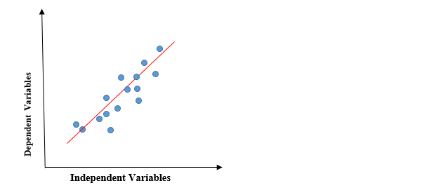
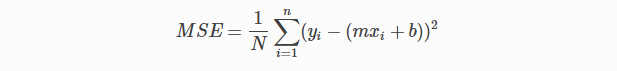
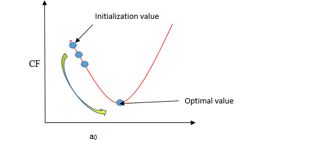
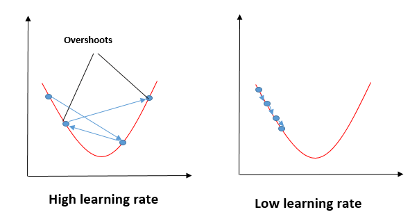

# Linear Regression 

## Regression

Regression is a supervised learning technique that supports finding the correlation among variables. A regression problem is when the output variable is a real or continuous value.

A regression model predicts continuous values. For example, regression models make predictions that answer questions like the following:

- What is the value of a house in California?

- What is the probability that a user will click on this ad?

## classification

A classification model predicts discrete values. For example, classification models make predictions that answer questions like the following:

- Is a given email message spam or not spam?

- Is this an image of a dog, a cat, or a hamster?

## Types of Regression models

1. Linear regression
2. Polynomial regression
3. Logistics regression

## 1. Linear regression

- Linear regression is a quiet and simple statistical regression method used for predictive analysis and shows the relationship between the continuous variables.

- Linear regression shows the linear relationship between the independent variable (X-axis) and the dependent variable (Y-axis).

> If there is a single input variable (x), such linear regression is called **simple linear regression**.

> if there is more than one input variable, such linear regression is called **multiple linear regression**.

- The red line is referred to as the best fit straight line.

- To calculate best-fit line linear regression uses a traditional slope-intercept form.

> `y = mx+b`
>
> or 
>
> `y = a0 + a1x`

y= Dependent Variable.

x= Independent Variable.

a0 = b = intercept of the line.

a1 = m = Linear regression coefficient.(slope of the line)

## Cost Function

- The cost function helps to figure out the best possible values for a0 and a1, which provides the best fit line for the data points.

- The linear regression models we'll examine here use a loss function called squared loss (also known as L2 loss). 

> = the square of the difference between the label and the prediction
= (observation - prediction(x))2 \
= (y - y')2

- In Linear Regression, Mean Squared Error (MSE) cost function is used, which is the average of squared error that occurred between the predicted values and actual values.

- Let’s y = actual values, yi = predicted values

## Gradient descent

- Gradient descent is a method of updating a0 and a1 to minimize the cost function (MSE).

- In the gradient descent algorithm, the number of steps you take is the learning rate, and this decides how fast the algorithm converges to the minima.

#### Learning rate

