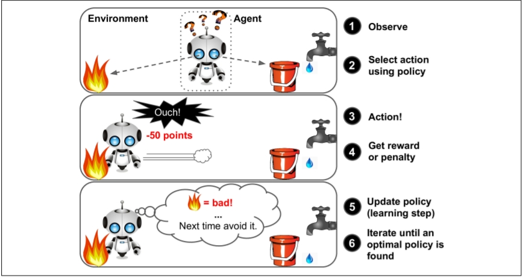

# Machine Learning Zero To Hero

people are really getting confused between these terms like AI, ML, DL. we are first understand what is the difference between this three terms.

**Artificial Intelligence** : AI systems are classified by their ability to imitate human behaviors, the hardware they use to do so, their applications in the real world and the theory of mind.

**Machine Learning** : Machine Learning is a subset of Artificial Intelligence that uses statistical learning algorithms to build systems that have the ability to automatically learn and improve from experiences without being explicitly programmed.

**Deep Learning** : Deep learning is a machine learning technique that is inspired by the way a human brain filters information, it is basically learning from examples. 

## Tools and Technologies we use

- python 
- numpy
- pandas
- matplotlib
- seaborn
- scikit-learn
- tensorflow

## Basic requirements

- python 
- Linear algebra
- calculus
- statistics

## Machine Learning

### Applications of ML

- recommendation systems on Netflix, Youtube, Spotify

- Self-driving cars

- search engines like google and yahoo

- voice assistants like google home and amazon alexa

In Machine Learning we train the algorithm by providing it with a lot of data and allowing it to learn more about the processed information.

### Types of Machine Learning

- Supervised Learning

- Unsupervised Learning

- Reinforcement Learning

### Supervised Learning and it's Algorithms

> In supervised learning, the training data you feed to the algorithm includes the desired
solutions, called labels.

- k-Nearest Neighbors
- Linear Regression
- Logistic Regression
- Support Vector Machines (SVMs)
- Naïve Bayes Classifier Algorithm
- Decision Trees and Random Forests
- Neural networks

A typical supervised learning task is classification. The spam filter is a good example
of this: it is trained with many example emails along with their class (spam or ham),
and it must learn how to classify new emails.

### Unsupervised Learning and it's algorithm

> In unsupervised learning, as you might guess, the training data is unlabeled. The system tries to learn without a teacher.

- Clustering
   - K Means
   - DBSCAN
   - Hierarchical Cluster Analysis (HCA)
   
- Anomaly detection and novelty detection
    - One-class SVM
    - Isolation Forest

- Visualization and dimensionality reduction

    - Principal Component Analysis (PCA)
    - Kernel PCA
    - Locally-Linear Embedding (LLE)
    - t-distributed Stochastic Neighbor Embedding (t-SNE)

For example, say you have a lot of data about your blog’s visitors. You may want to
run a clustering algorithm to try to detect groups of similar visitors. At
no point do you tell the algorithm which group a visitor belongs to: it finds those
connections without your help. For example, it might notice that 40% of your visitors
are males who love comic books and generally read your blog in the evening, while
20% are young sci-fi lovers who visit during the weekends, and so on. If you use a
hierarchical clustering algorithm, it may also subdivide each group into smaller
groups. This may help you target your posts for each group

### Reinforcement Learning

> Reinforcement Learning is a very different beast. The learning system, called an agent
in this context, can observe the environment, select and perform actions, and get
rewards in return (or penalties in the form of negative rewards) It
must then learn by itself what is the best strategy, called a policy, to get the most
reward over time. 

## Batch and Online Learning

### Batch Learning

- In batch learning, the system is incapable of learning incrementally.
- it must be trained
using all the available data.
- This will generally take a lot of time and computing
resources, so it is typically done offline.
- First the system is trained, and then it is
launched into production and runs without learning anymore; it just applies what it
has learned. 
- This is called offline learning.

- If you want a batch learning system to know about new data (such as a new type of
spam), you need to train a new version of the system from scratch on the full dataset
(not just the new data, but also the old data), then stop the old system and replace it
with the new one

### Online Learning

- In online learning, you train the system incrementally by feeding it data instances
sequentially, either individually or by small groups called mini-batches. 
- Each learning
step is fast and cheap, so the system can learn about new data on the fly, as it arrives.

- Online learning is great for systems that receive data as a continuous flow (e.g., stock
prices) and need to adapt to change rapidly or autonomously.

## Popular open data repositories

[UC Irvine Machine Learning Repository](http://archive.ics.uci.edu/ml/index.php)

[Kaggle datasets](https://www.kaggle.com/datasets)

[Amazon AWS datasets](https://registry.opendata.aws/)

